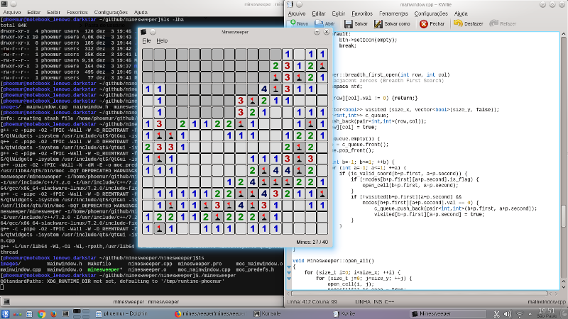

# minesweeper

This is an implementation of Minesweeper written in C++ and Qt

Author: Fernando B. Giannasi

# Requirements
C++11

Qt 5

# Instructions to compile and Run

 * mkdir -p build
 * cd build
 * cmake ..
 * make
 * ./minesweeper

    
